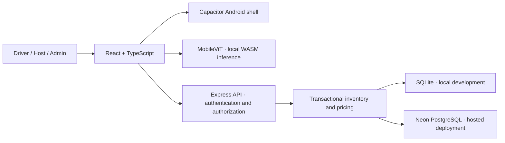

<div align="center">

# Parkly
### Your spot, sorted.

**Find parking. Share your space. Arrive with a plan.**

A mobile-first parking app for everyday trips, longer stays, and events—built around Hyderabad, with separate Driver, Host, and Admin workspaces.

[**Open the web app**](https://parkly-api-pslb.onrender.com) · [**Download Android APK**](https://github.com/safwanshk11/iqoo-hyd/releases/latest/download/Parkly-debug.apk) · [**Latest release**](https://github.com/safwanshk11/iqoo-hyd/releases/latest)

</div>

---

## What is Parkly?

Parking often starts with uncertainty: where to go, whether your vehicle fits, how much a stay costs, and how to find the entrance. Parkly brings those decisions into one flow: set your requirements, choose a destination and time, reserve a space, and carry a QR entry pass.

Hosts can list available space, set rates, manage availability, and check arriving guests. Administrators review listings before they become bookable. Event organizers can reserve shared capacity and distribute guest invitation links without double-counting the same spaces.

**This repository is a working prototype with demonstration inventory.** It does not process payments or grant real-world parking rights. The Android download is a debug-signed test APK.

## Explore the app

| Workspace | What you can do |
|---|---|
| **Driver** | Set vehicle and parking preferences; search by destination or current location; browse a map; save spaces; book and cancel; get directions; download or share PDF QR passes. |
| **Host** | Submit a listing with local photo analysis; edit rates and access instructions; pause listings; block unavailable periods; manage arrivals and verify passes. |
| **Admin** | Approve, reject, or pause listings; suspend or reactivate accounts; delete eligible non-admin accounts with explicit confirmation. |
| **Event organizer** | Reserve capacity across compatible spaces, share an invitation, and track guest claims from the Driver workspace. |

### A walkthrough worth trying

1. **Driver:** choose a vehicle and preferences, then search Jubilee Hills with future arrival and departure times.
2. **Discovery:** compare cards and the map, open a space, and inspect its entrance instructions and quote.
3. **Booking:** reserve using a fictional registration, then open the QR pass and download or share its PDF.
4. **Host:** add a space, run the photo analysis, and submit it for review.
5. **Admin:** approve that listing; return to Driver search to see the newly bookable space.
6. **Availability:** block a free time period as Host and check the change from Driver search.
7. **Events:** reserve event capacity and use a second account to claim a guest pass.

Use different accounts on the two phones so ownership and role boundaries are visible. Accounts and data created on your local server are separate from the hosted deployment. No demo passwords or personal walkthrough data are committed to this repository.

## On-device AI

The host listing flow uses the open-source **`Xenova/mobilevit-xx-small`** image classification model through **Transformers.js**, running with CPU/WebAssembly on the client.

- The model downloads on first use, so that first analysis needs connectivity and may take a while.
- Photo inference runs locally; the analysis flow does not upload the photo to the API.
- The output supplies general scene labels for the listing workflow.
- It does **not** measure a parking bay, establish vehicle fit, verify ownership, or certify parking safety. Those require a purpose-trained model and a validated capture process.

This is local inference within the application, not a hosted AI completion endpoint. Booking, account management, and pass verification still require the API; Parkly is not an entirely offline app.

## Architecture



| Layer | Technology |
|---|---|
| Interface | React 19, TypeScript, Vite, CSS, Lucide icons |
| Android | Capacitor 6, native filesystem and sharing, native HTTP support |
| Maps | Leaflet, React Leaflet, OpenStreetMap |
| Passes | QR codes and jsPDF |
| AI | Transformers.js and MobileViT |
| API | Node.js, Express, salted scrypt password hashes |
| Storage | SQLite locally; Neon PostgreSQL in deployment |
| Hosting | Render, serving the web build and API together |

## Run locally

**Requirements:** Node.js 20.20+ and npm. Android builds additionally need JDK 17 and an Android SDK compatible with the checked-in Gradle project.

```sh
git clone https://github.com/safwanshk11/iqoo-hyd.git
cd iqoo-hyd
npm ci
DATABASE_URL='' npm run dev
```

Open **http://localhost:5173**. Vite forwards `/api` to the local API on port **3001**. SQLite data lives in `data/parkly.sqlite`; starter parking inventory is inserted when the database is empty.

Register your own account in the app. Registration requires a password of at least 12 characters. Choose Host at registration, or use **Become a host** later. The expanding navigation menu contains the account and workspace controls.

To run a built web app locally:

```sh
npm run build
DATABASE_URL='' npm start
# Open http://localhost:3001
```

### Configuration

| Variable | Purpose |
|---|---|
| `DATABASE_URL` | Server-only Neon connection string. Leave empty to use SQLite. |
| `PORT` | API listening port; defaults to `3001`. |
| `NODE_ENV=production` | Enables secure session cookies; deploy behind HTTPS. |
| `APP_ORIGINS` | Comma-separated exact allowed frontend origins when using separate domains. |
| `VITE_API_URL` | Public API endpoint baked into the frontend/APK at build time. |

The server loads `.env`. Never put database credentials in a `VITE_` variable: those values are exposed in the client bundle. Web builds default to same-origin `/api`; native development builds default to `http://localhost:3001/api`.

### Bootstrap an administrator

Register the intended account first, then run this trusted server command against the same database:

```sh
# Local SQLite, even if .env contains a Neon URL
DATABASE_URL='' npm run admin:grant -- your-email@example.com

# Configured Neon database
npm run admin:grant -- your-email@example.com
```

Reload or sign in again to access Admin. Registration and workspace switching cannot grant the Admin role.

## Android: download or build

The [latest GitHub release](https://github.com/safwanshk11/iqoo-hyd/releases/latest) contains **Parkly-debug.apk**, configured for the hosted API. It does not need a USB connection to a development laptop. Android may ask you to allow installation from the app used to download it.

**Package:** `com.safwanshk.parkly`. These are test builds, not Play Store releases. Updating an existing installation requires a compatible signing key; APKs built on a different computer may use a different debug key.

### Build for the hosted API

```sh
VITE_API_URL=https://parkly-api-pslb.onrender.com/api npm run android:apk
```

Output: `android/app/build/outputs/apk/debug/app-debug.apk`.

### Run against your laptop over USB

Start the local server, enable USB debugging, and authorize the laptop on the phone:

```sh
DATABASE_URL='' npm run dev
# In another terminal:
VITE_API_URL=http://localhost:3001/api npm run android:apk
adb devices -l
adb -s PHONE_SERIAL reverse tcp:3001 tcp:3001
adb -s PHONE_SERIAL install -r android/app/build/outputs/apk/debug/app-debug.apk
adb -s PHONE_SERIAL shell am start -n com.safwanshk.parkly/.MainActivity
```

For two phones, repeat the last three commands with each serial. Both use the same local inventory and accounts. Keep the laptop server running and USB connected; forwarding may need to be reapplied after reconnecting.

## Business rules

### Pricing

Hosts set hourly, daily, and monthly rates. The server calculates the authoritative quote and booking total; the UI does not determine the final price.

| Duration | Calculation |
|---|---|
| Under 24 hours | Rounded-up hourly charge, capped at the daily rate |
| 24 hours through 10 days | Complete days plus an hourly remainder capped at one daily rate |
| Over 10 days | Whole 30-day periods at the monthly rate, without proration |

For a space at ₹40/hour, ₹320/day, and ₹4,800/month: 3 hours costs ₹120, 12 hours costs ₹320, 10 days costs ₹3,200, and 11 days costs ₹4,800. The current maximum booking window is 32 days; a stay beyond 30 days incurs two monthly periods.

### Inventory and listing review

- New or edited host listings enter `pending_review`; approval makes them discoverable and bookable.
- Existing reservations remain valid when a listing is paused or returns to review.
- Host availability blocks cannot overlap reserved bookings or event allocations.
- Future reservations protect capacity and vehicle restrictions from incompatible edits.
- Individual bookings and event allocations draw from shared inventory. PostgreSQL inventory transactions use an advisory lock to prevent overselling under concurrent requests.
- Current-location search matches spaces within 10 km and ranks by geographic distance, not driving or walking distance. Coordinates are used on the client for matching.

### Account protection

Passwords are salted and hashed with scrypt. Random session tokens are stored in HttpOnly cookies; the database stores token hashes. Sessions expire after seven days and are revoked on logout. The API checks account status, roles, and resource ownership independently of the UI.

Admin deletion requires entering the target email. It revokes sessions, removes the account profile, and pauses owned listings while retaining booking history. Upcoming bookings or events block deletion. Administrator accounts are protected from deletion through the UI/API.

## Verify the project

```sh
npm run build       # TypeScript + production web build
npm test            # Local authorization, inventory, location and pricing tests
npm run test:neon   # Same core integration coverage against isolated Neon tables
```

The Neon test command requires `DATABASE_URL`. It creates a randomly named test schema and removes that schema afterward; public tables are not used as test fixtures. Coverage includes role escalation prevention, ownership isolation, session expiry/revocation, deletion guards, listing review, pricing boundaries, and concurrent booking capacity.

## Deploy

`render.yaml` defines the Render service. Add `DATABASE_URL` as a server secret. Its build command installs build dependencies explicitly, builds the frontend, then runs `npm start` to serve the UI and API together. `/api/health` reports readiness and the application version.

A free Render instance may sleep while idle, so the first request can take longer. Warm up the app before a live walkthrough. Schema migrations preserve existing inventory and legacy records; old anonymous bookings are not automatically reassigned to newly registered users.

## Repository guide

```text
src/
  App.tsx             Driver, event, listing and pass flows
  auth/               Registration, sign-in and workspace routing
  host/               Host availability management
  admin/              Listing review and account controls
  shared/             API client, navigation, location and Chakra artwork
server/
  app.js              Shared authenticated API
  auth.js             Passwords, sessions and public account data
  database.js         SQLite/PostgreSQL adapter and migrations
  availability.js     Transactional availability operations
  pricing.js          Authoritative rate calculation
  store.js            SQLite inventory implementation
  neon-store.js       PostgreSQL inventory implementation
android/              Capacitor Android project
scripts/              Isolated Neon test runner
tests/                Integration and business-rule tests
docs/                 Product direction and release documentation
```

## Current limits and next steps

The implemented prototype supports an end-to-end parking demonstration. Production work remains: email verification and password recovery; real inventory and owner verification; payments, refunds and payouts; recurring opening hours; support/disputes; shared rate limiting and audit/retention policy; release signing; and device-specific performance testing for the vision model.

QR passes are verified online against ownership and booking status, not signed offline credentials. Model labels are not a parking-safety assessment. Native GPS, camera, sharing, and model performance can vary by phone and permissions.

## Credits

Functional inspiration: [JustPark](https://www.justpark.com/). Initial visual reference: [CampusLens](https://campuslens-tan.vercel.app/design-system), followed by Parkly's cream, navy, saffron and green styling with a subtle 24-spoke Chakra. Maps: OpenStreetMap. Icons: Lucide. Fonts: Geist, Geist Mono and Instrument Serif. No JustPark source code or real inventory was copied.

See [the product brief](docs/product-brief.md) for original scope. Check the hackathon's event-window requirements with its organizers before submitting; this repository's history predates the supplied window.
